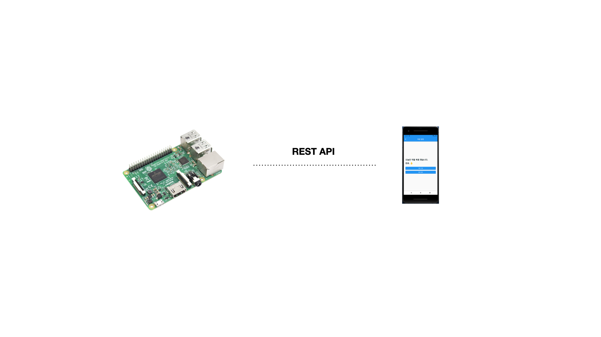
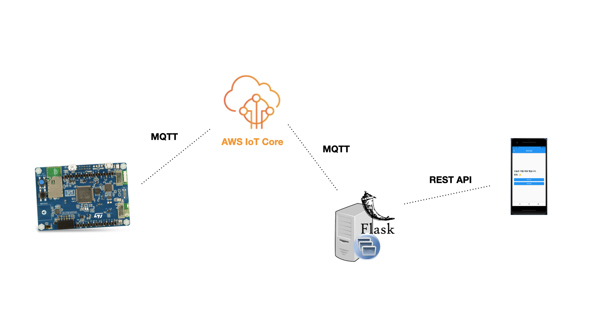

# MedicBox
혈압약 복용 확인을 위한 구급함

## Features
||B-L4S5I-IOT01A|RPi|
|---|---|---|
|복용 시간 지정|✅|✅|
|복용 여부 확인 표시등|✅|✅|
|3rd MQTT 브로커 지원|||
|음성 알람||✅|
|내 폰 찾기 알리미|||

## Architecture
- [B-L4S5I-IOT01A](https://www.st.com/en/evaluation-tools/b-l4s5i-iot01a.html) 펌웨어 or [RaspberryPi](https://www.raspberrypi.com/products/raspberry-pi-3-model-b-plus/) 서비스 스크립트
- 클라우드 MQTT 브로커 [AWS IoT Core](https://aws.amazon.com/ko/iot-core/)
- REST API 서비스 지원을 위한 [AWS MQTT Client](https://github.com/aws/aws-iot-device-sdk-python-v2) & [Flask](http://flask.pocoo.org)
- 모바일 애플리케이션 [Flutter](https://flutter.dev/)

### Option 1 - R.Pi based

### Option 2 - B-L4S5I-IOT01A based

## Award
[2022 서울 하드웨어 해커톤](Misc/shh.png) 우수상 🏆

## Reference
- [slideshare](https://www.slideshare.net/jisangkim90/medicbox)
- [YouTube](https://youtu.be/YxxHIMm7rWA)
